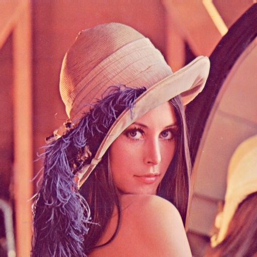
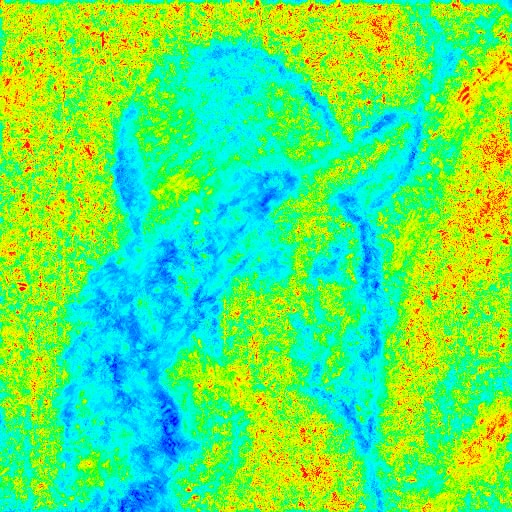
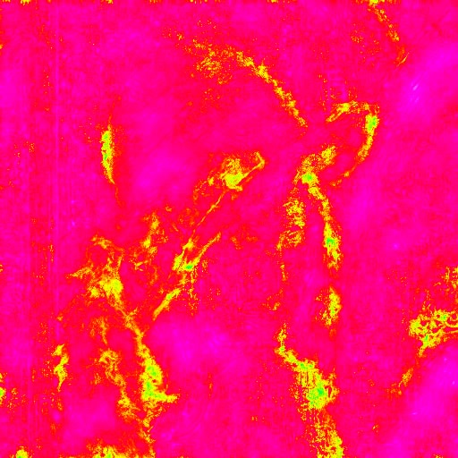
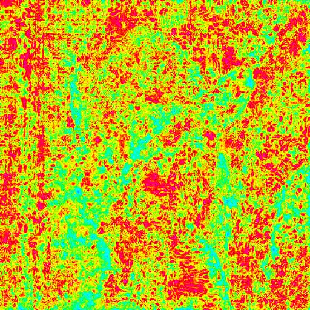

JPEG DCT coefficients access in C
=================================

This provides access via an array to the DCT coefficients
which can then be modified before being re-saved as another JPEG.
It depends on the IJG JPEG library (or libjpeg) which can be
found here: http://www.ijg.org/

USAGE
=====

Origin:  
  
[211044]

```
./jpegquant -q 2 lena.q100.jpg lena.q100.jq02.jpg
```
  
[220516]  
  
butteraugli: 0.751521

```
./jpegquant -q 4 lena.q100.jpg lena.q100.jq04.jpg
```
  
[215382]  
  
butteraugli: 0.973014

```
./jpegquant -q 10 lena.q100.jpg lena.q100.jq10.jpg
```
  
[179893]  
  
butteraugli: 1.955633

```
./jpegquant -q 20 lena.q100.jpg lena.q100.jq20.jpg
```
  
[163137]  
  
butteraugli: 2.807457

See also
========

* https://github.com/kud/jpegrescan
* https://github.com/ImageProcessing-ElectronicPublications/jpeg-recompress

Authors
=======

Copyright (C) 2012, Owen Campbell-Moore.  
Modify 2019-2020, zvezdochiot  
Public Domain Mark 1.0

HomePage
========

https://github.com/ImageProcessing-ElectronicPublications/jpegquant
