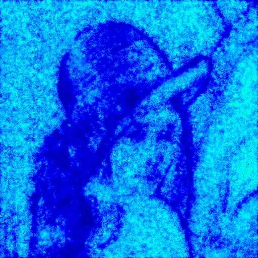
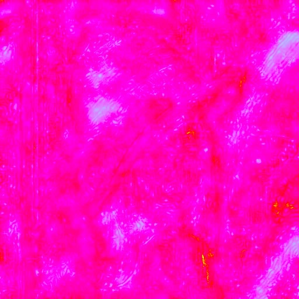

JPEG DCT coefficients access in C
=================================

This provides access via an array to the DCT coefficients
which can then be modified before being re-saved as another JPEG.
It depends on the IJG JPEG library (or libjpeg) which can be
found here: http://www.ijg.org/

USAGE
=====

Origin:  


```
./jpegquant lena.q100.jpg lena.q100.jq50.jpg 50
```
 

```
./jpegquant lena.q100.jpg lena.q100.jq25.jpg 25
```
 

```
./jpegquant lena.q100.jpg lena.q100.jq10.jpg 10
```
 

```
./jpegquant lena.q100.jpg lena.q100.jq05.jpg 5
```
 

HomePage
========

https://github.com/ImageProcessing-ElectronicPublications/jpegquant
